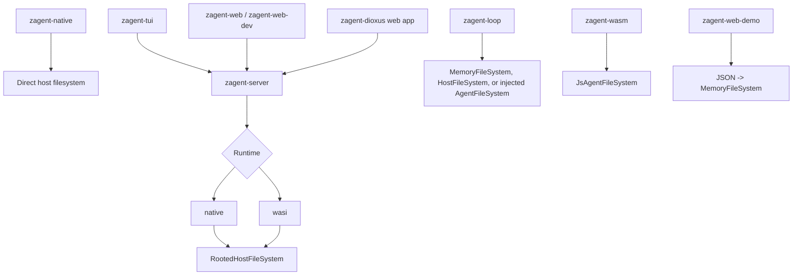
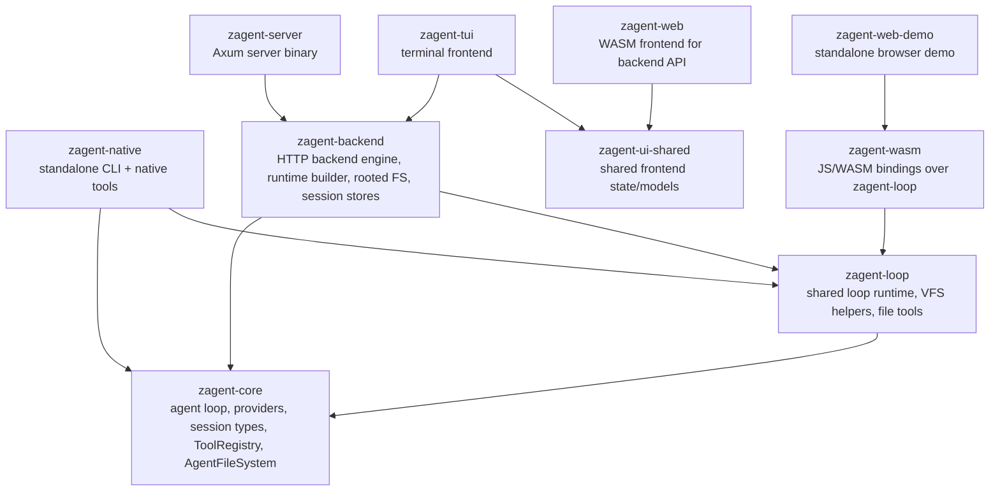
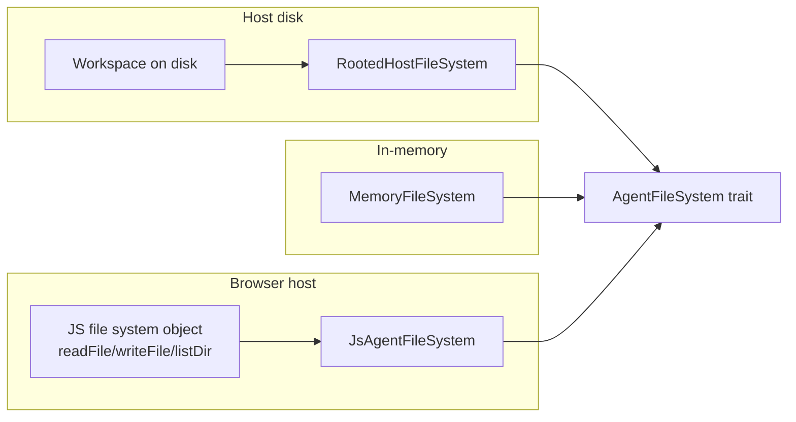

# Deployment Guide

This guide documents the supported ways to run zAgent today, which runtime and storage model each option uses, and which filesystem or VFS layer backs file tools in each deployment.

## Deployment Matrix

| Deployment option | Main components | Runs where | Session storage | Filesystem model | Tool surface |
|---|---|---|---|---|---|
| Native CLI | `zagent-native` | Local process | SurrealDB | Direct host filesystem access | Full native toolset including `shell_exec` |
| Server + TUI | `zagent-server` + `zagent-tui` | Local or remote backend, terminal client | SurrealDB in `native`, JSON in `wasi` | Jailed host filesystem rooted at the backend working directory | `native`: full tools, `wasi`: no `shell_exec` |
| Server + Web | `zagent-server` + `zagent-web` or `zagent-web-dev` | Backend server plus browser frontend | SurrealDB in `native`, JSON in `wasi` | Jailed host filesystem rooted at the backend working directory | `native`: full tools, `wasi`: no `shell_exec` |
| Dioxus stack | SurrealDB + `zagent-server` + `zagent-dioxus` web app | Local fullstack dev stack | SurrealDB | Jailed host filesystem rooted at the backend working directory | Full backend-native toolset |
| Loop Rust library | `zagent-loop` | Inside another Rust process or reused by other zAgent runtimes | In-memory session store by default | In-memory VFS, direct host FS, or any injected `AgentFileSystem` | Shared filesystem-backed file tools |
| Browser/WASM embedding | `zagent-wasm` | Browser or JS host | Host-defined | JavaScript-owned VFS adapter bridged into Rust | Embedded file tools only |
| Standalone browser demo | `zagent-web-demo` | Browser via Trunk | Per-page fresh in-memory state | JSON-defined in-memory VFS | Embedded file tools only |

## Topology Overview



## Module Relationships

At a high level, the workspace splits into three layers:

- `zagent-core`: the provider-agnostic agent loop, provider traits, session types, tool abstractions, and shared filesystem trait.
- Runtime and product crates: `zagent-native`, `zagent-backend`, `zagent-server`, `zagent-tui`, `zagent-web`, `zagent-ui-shared`, and the Dioxus stack.
- Loop and embedding crates: `zagent-loop`, `zagent-wasm`, and `zagent-web-demo`.

### Crate relationship diagram



### What `zagent-loop` is

`zagent-loop` is the shared loop/runtime facade built directly on top of `zagent-core`.

It packages together:

- `LoopAgent`, which calls the core agent loop with an injected provider map, tool registry, session store, and filesystem
- `MemoryFileSystem`, for deterministic in-memory workspaces
- `HostFileSystem`, for direct host filesystem access without backend jail semantics
- `InMemorySessionStore`, for process-local session state
- `build_file_tools`, which registers the shared filesystem-backed file toolset: `file_read`, `file_write`, `file_edit`, and `list_dir`

It is intentionally narrower than the full backend runtime bundles:

- no HTTP server
- no SurrealDB integration
- no backend SSE/event sync layer
- no MCP integration
- no shell or web tools by default, though `zagent-native` and `zagent-backend` now compose those extra tools around the shared file tool layer

### Where `zagent-loop` is used today

- Directly by `zagent-wasm`, which re-exports the loop agent types and adds the JS binding adapter layer.
- Indirectly by `zagent-web-demo`, which depends on `zagent-wasm` and builds a browser-run demo on top of the loop agent.
- By `zagent-backend`, for the shared in-memory session store, `MemoryFileSystem`, and filesystem-backed file tool registration.
- By `zagent-native`, for the shared direct-host filesystem adapter and filesystem-backed file tool registration.
- Potentially by external Rust hosts that want to embed zAgent without running `zagent-server`.

### Where `zagent-loop` is not the whole runtime

- `zagent-server` still owns HTTP routing and process/runtime bootstrapping.
- `zagent-backend` still owns MCP integration, session-store selection, rooted host filesystem jail semantics, and SSE/event handling.
- `zagent-native` still owns REPL flow, SurrealDB persistence, tracing, and shell/web tool registration.
- `zagent-web` and `zagent-tui` are still clients of the backend API, not in-process loop hosts.

### Why this matters

There is now one shared loop layer and several deployment-specific shells around it:

- `zagent-loop` owns the reusable filesystem-backed file tools, in-memory session store, host/in-memory filesystem adapters, and embeddable loop wrapper.
- `zagent-backend` composes that shared loop layer with rooted host filesystem access, selectable session stores, MCP support, optional shell access, and HTTP-facing engine state.
- `zagent-native` composes the shared loop file-tool layer with REPL/session UX plus native-only shell and web tools.

That split keeps the browser/embedded path constrained while removing the duplicated file-tool, memory session, and in-memory VFS wiring that previously existed across the backend and embedded layers.

## VFS Modules

These are the core filesystem abstractions used across the different deployment modes.

| Module | Purpose | Used by |
|---|---|---|
| `crates/zagent-core/src/fs.rs` | Defines the shared `AgentFileSystem` trait and `FileSystemEntry` | All abstracted filesystem deployments |
| `crates/zagent-backend/src/fs.rs` `RootedHostFileSystem` | Exposes a jailed view of the real host filesystem rooted at the configured working directory | `zagent-server` in both `native` and `wasi` runtimes |
| `crates/zagent-backend/src/fs.rs` `MemoryFileSystem` | In-memory backend VFS implementation used for injected filesystem scenarios and tests | Backend embedding and backend VFS tests |
| `crates/zagent-loop/src/fs.rs` `MemoryFileSystem` | In-memory VFS for the shared loop crate | `zagent-loop`, `zagent-web-demo`, backend injected-FS tests, custom Rust hosts |
| `crates/zagent-loop/src/fs.rs` `HostFileSystem` | Direct host filesystem adapter for shared file tools without backend jailing | `zagent-native` |
| `crates/zagent-wasm/src/bindings.rs` `JsAgentFileSystem` | Adapter that turns JS `readFile`, `writeFile`, and `listDir` callbacks into an `AgentFileSystem` | `zagent-wasm` browser embedding |

## VFS Ownership Model



## 1. Native CLI

Use this when you want a local, single-process coding agent with full shell access.

### Start

```bash
just run-native
```

Or:

```bash
cargo run -p zagent-native
```

### Filesystem behavior

- The native CLI uses `zagent-loop::HostFileSystem` plus the shared filesystem-backed file tools.
- Relative paths resolve from the process working directory.
- `shell_exec` is available.

### Context policy configuration

- Native and server-backed deployments load `context_management_policy` from `zagent-config.yaml`.
- That policy controls whether prompt assembly includes discovered `AGENTS.md`, `RULES.md`, `SKILL.md`, and custom agent catalogs.
- Browser-side embedding through `zagent-wasm` still accepts the policy explicitly from the host because it does not load the workspace YAML config directly.

### When to use it

- Local coding workflows
- Full shell access
- Fastest path for REPL and one-shot prompts

## 2. Server + TUI

Use this when you want the shared backend engine with a terminal UI client.

### Native runtime

```bash
just run-server
just run-tui
```

### WASI-style restricted runtime

```bash
just run-server-wasi
just run-tui
```

### Filesystem behavior

- Both backend runtimes use `RootedHostFileSystem` by default.
- The backend jail is rooted at the server working directory, so file tools stay inside that configured root.
- In `native`, the server registers `shell_exec`, file tools, and web tools.
- In `wasi`, the server registers file tools and web tools, but not `shell_exec`.

### VFS implications

- This is a host-owned filesystem view, not a browser-owned VFS.
- If you need an injected in-memory workspace instead of host disk access, use the backend tool registration helpers that accept an injected filesystem.

## 3. Server + Web

Use this when you want the standard browser frontend talking to the HTTP backend.

### Dev helper

```bash
just wasm-target
just trunk-install
just run-web-dev
```

### Manual split terminals

```bash
just run-server
just run-web-manual
```

To run the browser frontend against the restricted backend:

```bash
just run-server-wasi
cd crates/zagent-web
trunk serve --proxy-backend http://127.0.0.1:8787/api --proxy-rewrite /api
```

### Filesystem behavior

- The browser UI does not own the filesystem.
- All file tool calls execute on the backend and therefore use the backend runtime's filesystem layer.
- In practice that means `RootedHostFileSystem` for both `native` and `wasi`, with `shell_exec` only available in `native`.

## 4. Dioxus Stack

This repo also includes an alternate web stack under `crates/zagent-dioxus`.

### Start

```bash
just run-dioxus-dev
```

That recipe starts:

- SurrealDB
- `zagent-server`
- The Dioxus web app

### Filesystem behavior

- The Dioxus web app still relies on `zagent-server` for agent execution.
- Because of that, it uses the same backend filesystem model as the standard server deployments: `RootedHostFileSystem` rooted at the backend working directory.

## 5. Loop Rust Library

Use this when zAgent needs to run inside another Rust application or when another zAgent runtime wants to reuse the shared loop/VFS/file-tool layer without spinning up the HTTP server.

### Main crate

- `crates/zagent-loop`

### Conceptually

- This crate is the shared loop-oriented runtime surface for zAgent.
- It is not the same thing as `zagent-backend` with fewer routes.
- Think of it as the minimal in-process package for hosts that want to provide their own filesystem, provider configuration, runtime environment, and context policy.

### Filesystem behavior

- The loop crate exposes `MemoryFileSystem` for in-memory workspaces and `HostFileSystem` for direct host access.
- The shared loop tool registry includes `file_read`, `file_write`, `file_edit`, and `list_dir`.
- No shell or web tools are registered by default in the loop crate; higher-level runtimes compose those separately.
- `ContextManagementPolicy` lets each embedding decide whether AGENTS rules, RULES files, skill catalogs, and custom agent catalogs are injected into prompt context.

### Typical usage

```rust
use std::sync::Arc;
use zagent_loop::{ContextManagementPolicy, LoopAgent, LoopAgentOptions, MemoryFileSystem};

let fs = Arc::new(MemoryFileSystem::from_files([
    ("AGENTS.md", "Only use files from this virtual workspace.\n"),
    ("src/lib.rs", "pub fn answer() -> u32 { 42 }\n"),
]));

let mut options = LoopAgentOptions::new(
  "openrouter",
  "openai/gpt-4o-mini",
  "loop",
  ".",
);
options.context_management_policy = ContextManagementPolicy {
  include_agents_md: true,
  include_rules_md: true,
  include_skills: false,
  include_custom_agents: false,
};

let agent = LoopAgent::new(
    http_client,
    providers,
    fs,
  options,
)?;
```

### Best fit

- Plugin hosts
- Tests with deterministic workspaces
- Sandboxed agent execution inside another Rust service

## 6. Browser/WASM Embedding

Use this when you want the agent itself to run in the browser and the host application to control the visible workspace.

### Main crate

- `crates/zagent-wasm`

### Filesystem behavior

- `zagent-wasm` wraps a JS file system object in `JsAgentFileSystem`.
- The JS host must provide three functions: `readFile(path)`, `writeFile(path, content)`, and `listDir(path, recursive, maxDepth)`.
- The browser host controls what files exist and whether writes persist to memory, IndexedDB, OPFS, or a remote API.

### Typical usage

```javascript
const fileSystemAdapter = {
  async readFile(path) {
    return vfs[path];
  },
  async writeFile(path, content) {
    vfs[path] = content;
  },
  async listDir(path, recursive, maxDepth) {
    return listVirtualEntries(vfs, path, recursive, maxDepth);
  },
};

// Pass this adapter into the wasm binding layer implemented in
// crates/zagent-wasm/src/bindings.rs.
```

### Best fit

- Browser-native agent UX
- Host-controlled sandboxing
- Multi-tenant or per-tab virtual workspaces

## 7. Standalone Browser Demo

Use this when you want the simplest way to show an in-browser agent with a JSON-defined VFS.

### Start

```bash
just run-web-demo
```

Or open automatically:

```bash
just run-web-demo-open
```

### Filesystem behavior

- The demo parses the textarea JSON into a list of files.
- It then constructs `zagent_loop::MemoryFileSystem` from that JSON.
- Each run creates a fresh loop agent and fresh in-memory workspace.
- Nothing is written to the host disk unless you explicitly replace the VFS adapter in your own host.

## Choosing the Right Option

| Goal | Recommended option |
|---|---|
| Full local coding agent with shell access | Native CLI |
| Shared backend for terminal users | Server + TUI |
| Shared backend for browser users | Server + Web |
| Browser-only sandbox with host-owned files | Browser/WASM embedding |
| Deterministic in-memory integration inside Rust | Embedded Rust library |
| Quick in-browser demo of injected VFS | Standalone browser demo |

## Shared Runtime Layer

The old runtime-assembly TODO is now resolved in favor of a shared `zagent-loop` layer:

- `zagent-loop` replaces `zagent-embedded` as the reusable loop/runtime crate.
- Backend, native, and browser-facing loop hosts reuse the same filesystem-backed file tools, in-memory session store, and in-memory/direct-host filesystem adapters from that crate.
- Backend-specific concerns such as rooted filesystem jail semantics, MCP wiring, HTTP routing, and session-store selection remain in `zagent-backend`.

## Context Management Policy

`ContextManagementPolicy` is the shared knob for deciding what project context gets promoted into the effective system prompt.

It currently controls four independent sources:

- `include_agents_md`: include discovered `AGENTS.md` files
- `include_rules_md`: include discovered `RULES.md` files
- `include_skills`: include the skill catalog built from `SKILL.md` files
- `include_custom_agents`: include discovered custom agents and enable their routing/handoff catalog

Every deployment can set a different policy:

- `zagent-native` can keep the full default catalog for local coding workflows.
- `zagent-backend` can set the policy per engine/runtime as part of `BackendOptions`.
- `zagent-wasm` and browser hosts can pass a narrower policy when they want an intentionally smaller prompt surface.

## Current Non-Option: `zagent-wasi`

The `crates/zagent-wasi` crate is currently a scaffold, not a documented standalone deployment target. The practical restricted deployment today is `zagent-server --runtime wasi`, which keeps the backend in control while removing shell execution.